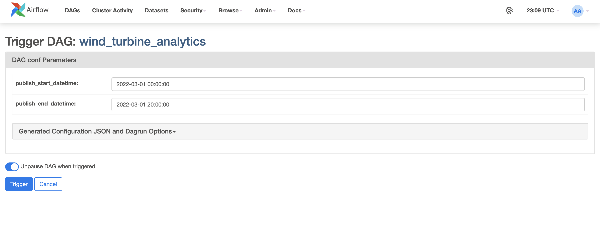
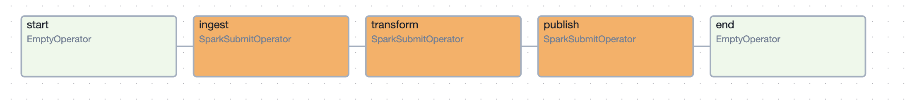
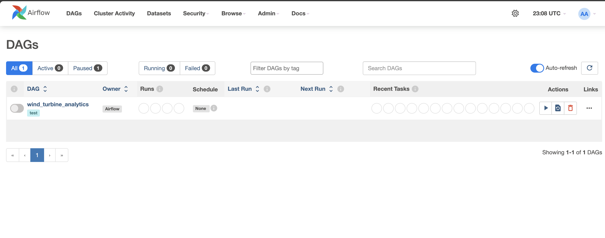
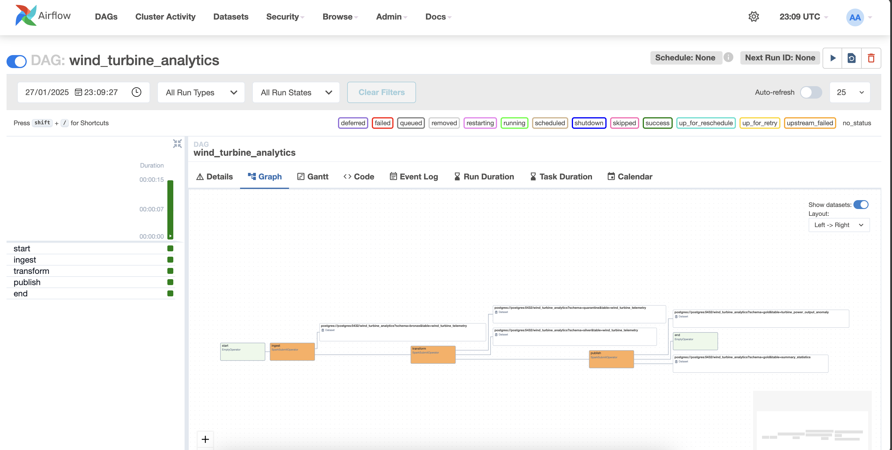
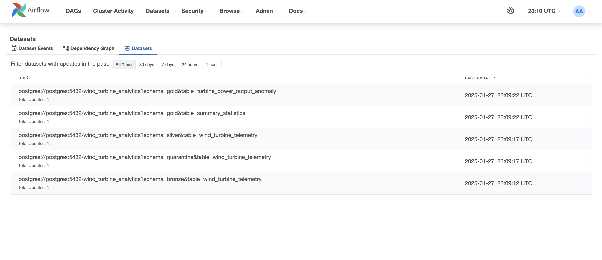
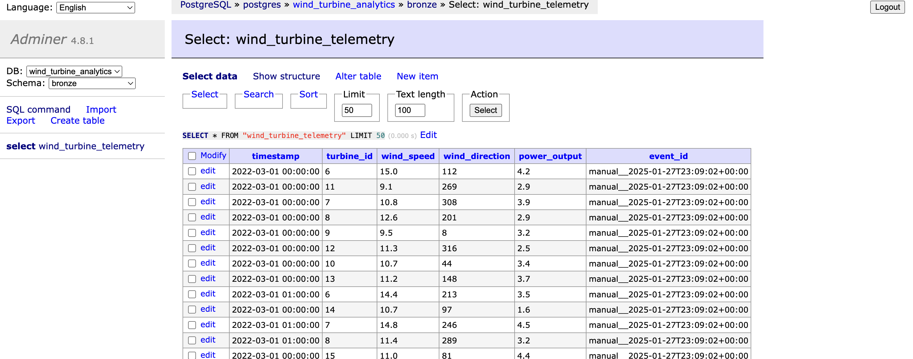
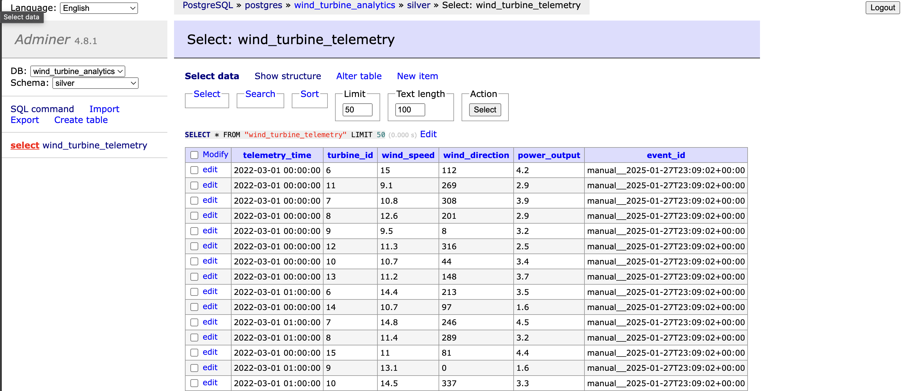
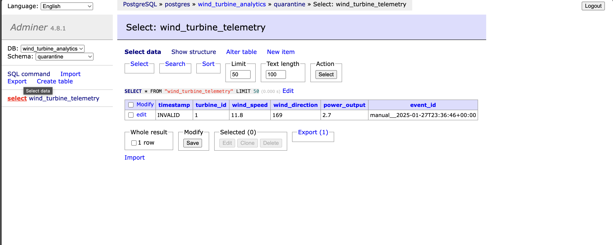
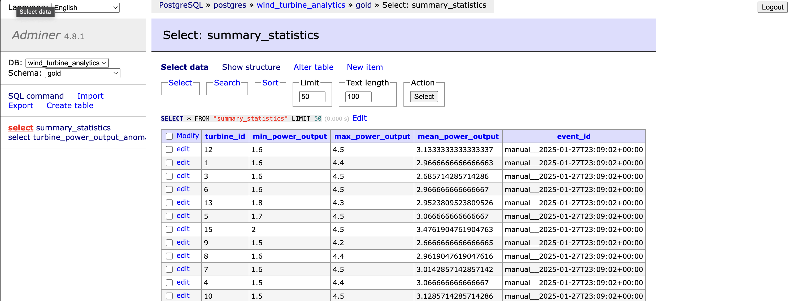
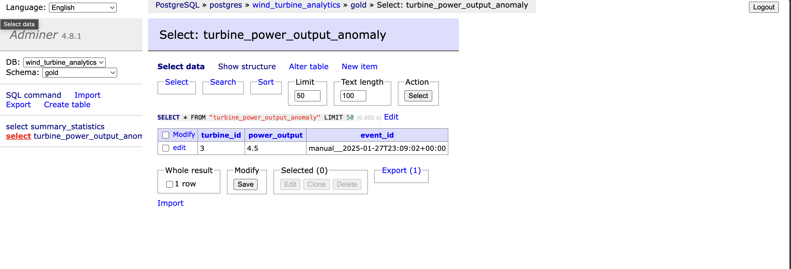

Wind Turbine Analytics
======================

## Summary

The analytics suite calculates summary statistics and finds wind turbine power output anomalies, using wind turbine telemetry data.

## System requirements

Software requirements:
- [Docker 4](https://www.docker.com)
- [Python 3.10](https://www.python.org)

Tested on macOS Sequoia 15.2

## Technical overview

### Key considerations

The solution uses [Apache Spark](https://spark.apache.org) for data transformations, to ensure:
- a standard stack: Spark is used by many organisations as well as being a foundation technology to the commercial [Databricks Intelligence Platform](https://www.databricks.com); it has a wide range of packages and tooling available (one example is the testing frameworks used in this project and defined in [pyproject.toml](./pyproject.toml))
- scalability: Spark is a distributed data processing framework, supporting data partitioning and distributing the processing of these partitions over a cluster of machines
- adaptability: Spark job deployments can range from local or self-hosted to using various cloud platforms (AWS EMR, Azure HD Insights, etc.), as well as supported by commercial offerings (Databricks etc.)

The solution uses [Apache Airflow](https://airflow.apache.org) for job orchestration, to ensure:
- a standard stack: Airflow is used by many organisations as well as being offered by various cloud providers as a SaaS (by AWS, Azure Data Factory etc.)
- scalability: Airflow is a distributed orchestration system which means additional worker nodes can be added to support the number of DAGs required
- adaptability: Deployments can range from local or on-prem to various cloud platforms

The solution uses a [Medallion architecture](https://www.databricks.com/glossary/medallion-architecture) to roll data through various stages of maturity.

### Assumptions

- The wind turbine telemetry data is provided as comma-delimeted CSV files, having the first row as headers.
- Timestamp information is only accepted in the Spark timestamp format, and only timestamps compatiblw with the [to_timestamp](https://spark.apache.org/docs/latest/api/python/reference/pyspark.sql/api/pyspark.sql.functions.to_timestamp.html) function are accepted.
- The solution is running Spark in local mode, not in distributed mode - though the master configuration (`local[*]`) will use all available CPU cores (as defined as an Airflow connection in [database/setup_connections.sql](./database/setup_connections.sql))
- The PostreSQL database, part of the Airflow deployment, is used as a data store, however definining the dedicated `wind_turbine_analytics` database for the purpose of this exercise. As defined in [database/init.sql](./database/init.sql).
- Each job run is uniquely distinguished by an `event_id` attribute that is added to the datasets.

### Data and schemas

#### Summary

- could not find erroneous data records in the original files so added a file [data/data_error.csv](./data/data_error.csv) with deliberatly invalid data 
- when ingesting  data from the CSVs (as defined in [src/wind_turbine_analytics/ingest.py](./src/wind_turbine_analytics/ingest.py)), data is validated against an expected schema [src/wind_turbine_analytics/schema.py](./src/wind_turbine_analytics/schema.py)

#### Data storage

In the PostgreSQL database, the following tables are created by the Spark job in the `wind_turbine_analytics` database:
- `bronze` schema:
    - `wind_turbine_telemetry` table - the data right from the CSV files, all String/Text data types
- `quarantine` schema:
    - `wind_turbine_telemetry` table - erroneous data records
- `silver` schema:
    - `wind_turbine_telemetry` table - valid data records, only data types are aligned, no transformations or aggregations performed
- `gold` schema:
    - `summary_statistics` table - aggregated data, summary statistics for each turbine, within the start and end dates provided in the DAG
    - `turbine_power_output_anomaly` table - turbines with anomalies in their power output, within the start and end dates provided in the DAG
        

Apart from the attributes provided, an additional `event_id` attribute is added to each dataset, and in turn, to each table in PostgreSQL.
The purpose of this `event_id` attribute is to distinguish between the different job runs.
Its value is defined as the Airflow run ID, as seen in the DAG definition [dags/wind_turbine_analytics.py](./dags/wind_turbine_analytics.py): `{{ run_id }}`

### Solution design

The [DAG](./dags/wind_turbine_analytics.py) provides an overview of the data flow:



#### Ingest

Defined in [src/wind_turbine_analytics/ingest.py](./src/wind_turbine_analytics/ingest.py).

It validates the input data against a schema and loads into the bronze layer.

#### Transform

Defined in [src/wind_turbine_analytics/transform.py](./src/wind_turbine_analytics/transform.py).

Loads bronze layer data and:
- converts attributes to the correct Spark data types
- flags any erroneous data records by adding the `is_error` column to the data frame
- emits erroneous data records to the quarantine layer
- emits valid data records to the silver layer

#### Publish

Defined in [src/wind_turbine_analytics/publish.py](./src/wind_turbine_analytics/publish.py).

Loads silver layer data and:
- calculates summary statistics for each turbine
- finds turbines with anomalies in their power output, within the start and end dates provided; as defined in the original spec:
    ```python
        turbine_power_output_anomaly_thresholds = gold_summary_statistics.withColumn(
            "power_output_anomaly_threshold_min",
            F.col("mean_power_output") - (F.col("stddev_power_output") * 2)
        ).withColumn(
            "power_output_anomaly_threshold_max",
            F.col("mean_power_output") + (F.col("stddev_power_output") * 2)
        )
    ```

## Running the analytics suite

### Set up

1. Start the Docker containers.

    `docker compose up -d`

2. Set up the Airflow `admin` account so that the UI can be accessed:

    `docker compose run airflow-webserver airflow users create --role Admin --username admin --email admin --firstname admin --lastname admin --password admin`

3. Set up the connections:

    `docker compose exec -it postgres bash -c 'psql -U $POSTGRES_USER -d $POSTGRES_DB -a -f /tmp/setup_connections.sql'`

### Triggering the job

1. Log in at [http://localhost:8080](http://localhost:8080).
2. Use the
    - username: `airflow`
    - password: `airflow`
3. You should see a DAG called `wind_turbine_analytics`
    
4. Trigger the DAG
    

### Monitoring and validation

#### In Airflow

The DAG should successfully complete:


The DAG should create Datasets in Airflow to each table produced:


#### In PostgreSQL

1. Open [http://localhost:8081](http://localhost:8081) in your browser
2. Log in by using
    - System: `PostgreSQL`
    - Server: `postgres`
    - Username: `wind_turbine_analytics`
    - Password: `wind_turbine_analytics`
    - Database: `wind_turbine_analytics`

Bronze table content:


Silver table content:


Quarantine table content:


Gold Summary table content:


Quarantine Anomalies table content:


### Tear down

`docker compose down`

## Testing

*It's recommended to use a [Virtual Environment (venv)](https://docs.python.org/3/library/venv.html) to install packages*

```sh
pip install '.[dev]'
pytest --cache-clear --capture=no -m "integration" ./src
```

Tests are defined in the [src/test](./src/test/) directory.
They're marked as Integration tests using the `@pytest.mark.integration` annotation; this is to communicate the fact they're not unit tests in the sense that they require a running instance of Spark.
No separate orchestration needed to spin up a Spark cluster for the purpose of the integration tests; the `pytest-spark` package takes care of it.